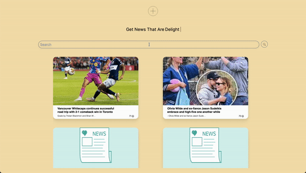

# What is ProtonNews?
There's a lot of negativity in news articles nowadays. "News fatigue" is a phenomenon where people become tired of the constant barrage of negative news. We thought of making a positive only news app. For some, a positive news app may be a welcome alternative that helps them stay informed without feeling emotionally drained.


# How did we build it?
The application primarily has two components: a frontend, and a backend.
- The frontend is build on the Next.js framework, with server-side rendering for ultra-fast loads
- The runtime used is Bun, which is a Node.js alternative popular for its low latency and responsiveness
- The backend is primarily built in FastAPI on Python
- The database where the articles are stored is server less Cockroach DB
- Sentiment analysis and summarizing of articles is done using 

But if you want to checkout our coor graphics, visit our _about us_ page ```http://localhost:3000/aboutus```


# Set-Up
Ready to try it out? Refer to the respective READMe's of the front-end (proton-news) and back-end. But, the general workflow is as follows:
1. Start the back-end server by running ```uvicorn main:app --reload```
2. Start the front-end with ```bun run dev```
3. If you'd like to scrape more data, ```http://localhost:8000/scrape?query=``` can be used with a specified query
